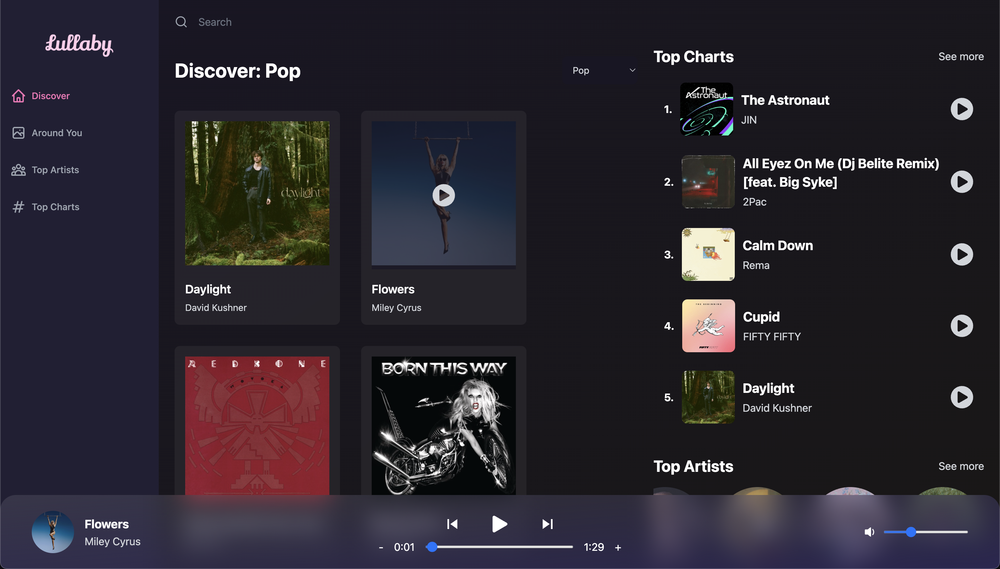

# LULLABY

## 🚀 About

This is a web application that allows users to search and stream music, similar to the popular music streaming service, Spotify.

## Features

This app includes the following features:

- A search function that allows users to search for songs and artists.
- A player that allows users to play, pause, skip and stream music.
- The ability to discover top charts based on current location and artists.
- Allows users to toggle songs based on genres.
- A swiper component to slide between different artists.
- Shows lyrics if available for a particular song.
- Responsive design that works on desktop and mobile devices.

## Technologies Used

This app was built using the following technologies:

- Node.js
- React.js
- Redux
- Tailwind CSS

## Run Locally

To get started with this app, you will need to have the following installed on your computer:

- Node.js
- npm
  
Clone the project

```bash
  git clone https://github.com/sttvk/Lullaby.git
```

Go to the project directory

```bash
  cd Lullaby
```

Install dependencies

```bash
  npm install
```

Set the following environment variables:
   - `VITE_SHAZAM_CORE_RAPID_API_KEY`: The key for ShazamCore API (https://rapidapi.com/tipsters/api/shazam-core) from Rapid API (Paid).
   - `VITE_GEO_API_KEY`: A secret to Geo Ipify API (https://geo.ipify.org/) to get tracks by location.
   
Remove all Firebase related files and API keys (Only for deployment).

Run `npm start` to start the app.

Open your web browser and navigate to `http://localhost:3000` to use the app.

## Screenshots




